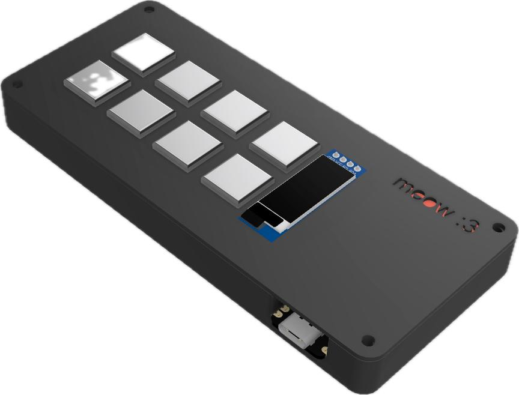
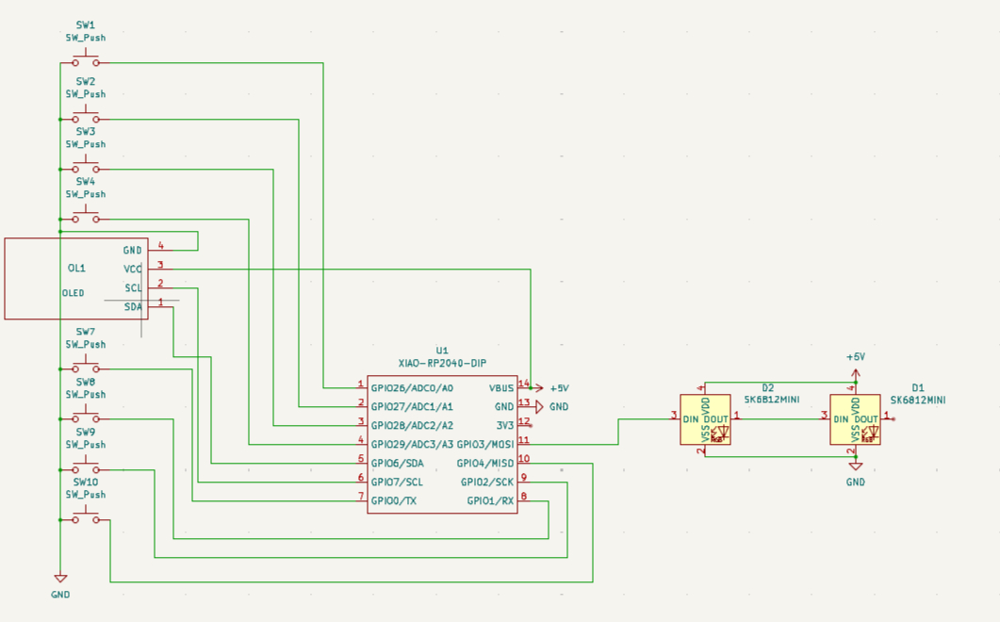
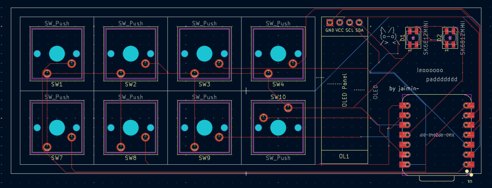
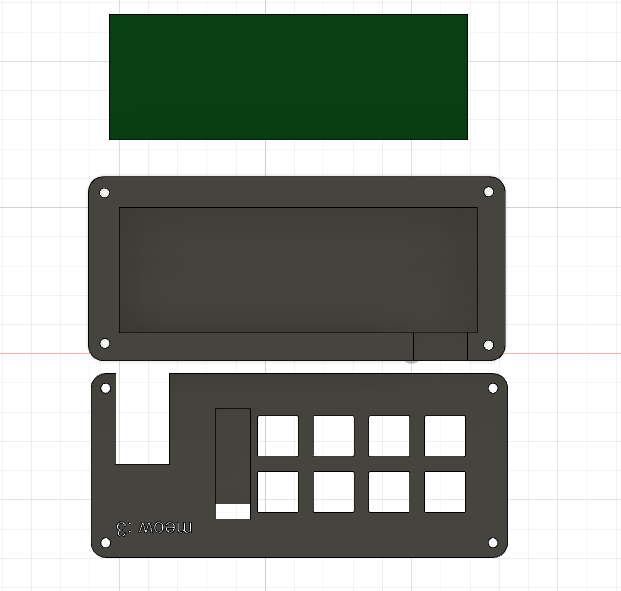

# LEOPAD - The 8-Key Macropad


LEOPAD (Layout Enhancement & Optimization Pad or a cute cat :3 ) is an 8-key programmable designed specifically for developers and programmers. It streamlines your coding workflow with dedicated shortcuts for common programming tasks, Git operations, and system controls.

## Why LEOPAD?

As developers, we constantly switch between coding, debugging, version control, and managing our workspace. LEOPAD puts the most essential shortcuts right at your fingertips with an intuitive 8-key layout that includes an OLED display for visual feedback and RGB lighting for style.

## Features

- **8 Mechanical Keys** - Cherry MX-compatible switches for tactile feedback
- **OLED Display** (128x64) - Real-time mode and key function display
- **RGB Backlighting** - 2x SK6812MINI addressable LEDs
- **4 Layer System**:
  - **Programming Mode** - Core coding shortcuts (Run/Build, Comment, Format, etc.)
  - **Git Mode** - Version control commands
  - **System Mode** - Media and window controls
  - **Custom Mode** - Programmable function keys (F13-F18)
- **KMK Firmware** - Python-based, easy to customize
- **Compact Design** - ~95mm x 80mm footprint

## Schematic



The circuit is built around the Seeed XIAO RP2040 microcontroller with:
- 8 push button switches with pull-down configuration
- 1x SSD1306 OLED display (I2C interface)
- 2x SK6812MINI RGB LEDs in series
- USB-C connectivity through the XIAO

## PCB Design




## Case Design




## Bill of Materials (BOM)

| Component | Quantity | Notes |
|-----------|----------|-------|
| Seeed XIAO RP2040 | 1 | Microcontroller |
| Cherry MX Compatible Switch | 8 | Your choice of switch type |
| Keycaps | 8 | 1U keycaps |
| SSD1306 OLED Display | 1 | 128x64, I2C interface |
| SK6812MINI RGB LED | 2 | Addressable RGB |
| 1N4148 Diode | 8 | Through-hole or SMD |
| Push Button Switch (SW_Push) | 8 | Alternative to MX switches |
| 3D Printed Case | 1 set | Top + Bottom pieces |
| M3 Screws | 4 | Optional, for case assembly |
| M3 Heat-set Inserts | 4 | Optional, for case |
| Rubber Feet | 4 | Anti-slip pads |

## Key Layout

### Layer 0: Programming Mode (Default)
```
┌─────┬─────┬─────┬─────┐
│ F5  │Ctrl+/│Ctrl+D│S+A+F│
│ Run │Cmt  │Dupl │Fmt  │
├─────┼─────┼─────┼─────┤
│Ctrl+`│C+S+F│C+S+G│Layer│
│Term │Srch │Git  │ ->  │
└─────┴─────┴─────┴─────┘
```

- **Key 1**: F5 - Run/Build current project
- **Key 2**: Ctrl+/ - Comment/Uncomment code
- **Key 3**: Ctrl+D - Duplicate line
- **Key 4**: Shift+Alt+F - Format document
- **Key 5**: Ctrl+` - Open terminal
- **Key 6**: Ctrl+Shift+F - Project-wide search
- **Key 7**: Ctrl+Shift+G - Open Git panel
- **Key 8**: Switch to Git Mode

### Layer 1: Git Mode
```
┌─────┬─────┬─────┬─────┐
│ Git │Cmit │Cmd  │Palte│
│Panel│Enter│Prfx │     │
├─────┼─────┼─────┼─────┤
│ Esc │Undo │RGB  │Layer│
│     │     │Togl │ ->  │
└─────┴─────┴─────┴─────┘
```

- Git operations and commands
- RGB lighting control
- Switch to System Mode

### Layer 2: System Mode
```
┌─────┬─────┬─────┬─────┐
│ New │Close│Next │Prev │
│ Win │ Tab │Tab  │Tab  │
├─────┼─────┼─────┼─────┤
│Vol+ │Vol- │Mute │Layer│
│     │     │     │ ->  │
└─────┴─────┴─────┴─────┘
```

- Window and tab management
- Media controls
- Switch to Custom Mode

### Layer 3: Custom Mode
```
┌─────┬─────┬─────┬─────┐
│ F13 │ F14 │ F15 │ F16 │
│     │     │     │     │
├─────┼─────┼─────┼─────┤
│ F17 │ F18 │ RGB │Layer│
│     │     │ Hue │ ->  │
└─────┴─────┴─────┴─────┘
```

- Programmable function keys
- Map to any software-specific shortcuts
- Back to Programming Mode

## Customization

The firmware is built on KMK, making it easy to customize:

- **Change Key Functions** - Edit the `keyboard.keymap` arrays
- **Add Macros** - Create custom macro sequences
- **Modify Layers** - Add or remove layers as needed
- **Update OLED Display** - Customize what info shows
- **RGB Effects** - Configure lighting patterns

Example custom macro:
```python
CUSTOM_MACRO = KC.MACRO(
    Press(KC.LCTRL), 
    Tap(KC.C), 
    Release(KC.LCTRL),
    # Add your sequence here
)
```

## Design Files

- **PCB**: KiCad project files in `PCB/` folder
- **Case**: STEP and STL files in `CAD/` folder  
- **Firmware**: KMK Python code in `firmware/` folder
- **Resources**: Schematics and images in `resources/` folder

## Preferences

- **PCB Color**: Black
- **Case Color**: Dark Gray / Charcoal

## Credits

Designed and built for the Hack Club Hackpad BLUEPRINT program.

**Designer**: JAIMIN PANSAL  
**GitHub**: jai-git4208
**License**: MIT

## With ❤️ by Jaimin
